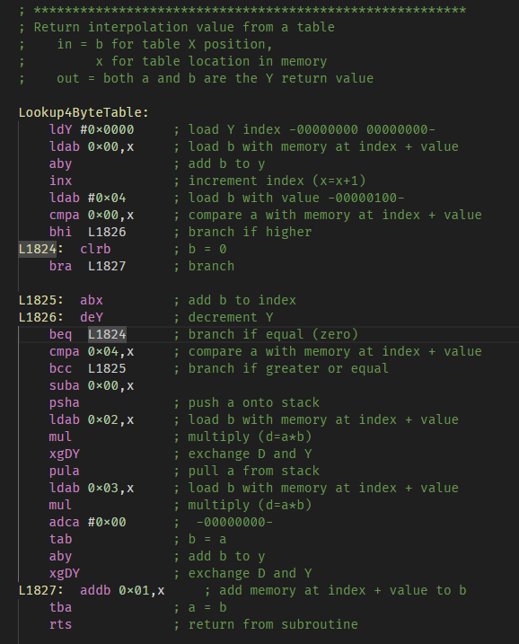

# mp68asm README

This is a syntax hightlighter Visual Studio Code Extension for the MPtune formatted ECU calibration files.
MPTune is an ECU calibration editor that uses a set of customized code bases and control calibrations for the '80 to early '90s Chrysler turbo 2.2L/2.5L engines.
<http://www.turbo-mopar.com/forums/forumdisplay.php?85-ECU-Code-Repository>

This extension does not completely support .lst, .mpt and .tpl files.

## Example

&nbsp;&nbsp;&nbsp;&nbsp;

## Known Issues

Branches (bmi, bpl, etc...) and bit operations (brset, brclr) still missing highlighting on labels and immediates.

## Release Notes

### 0.0.1

Initial release of MP 68 asm.
